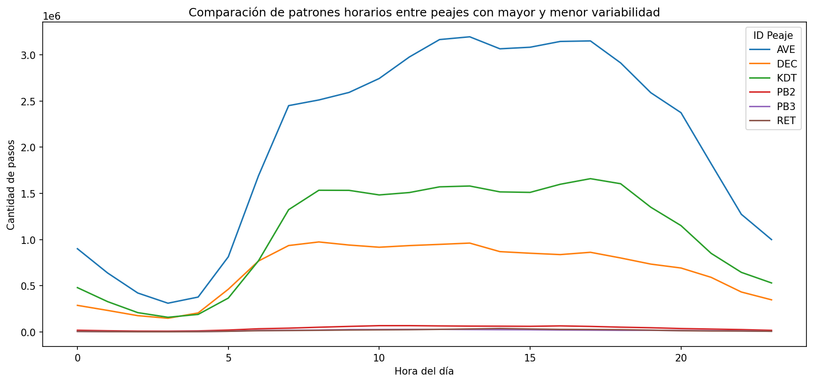
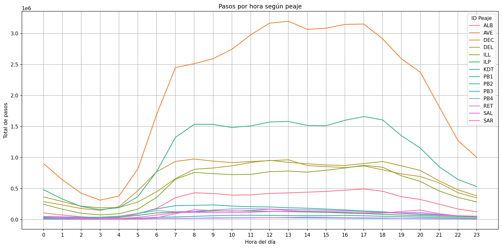
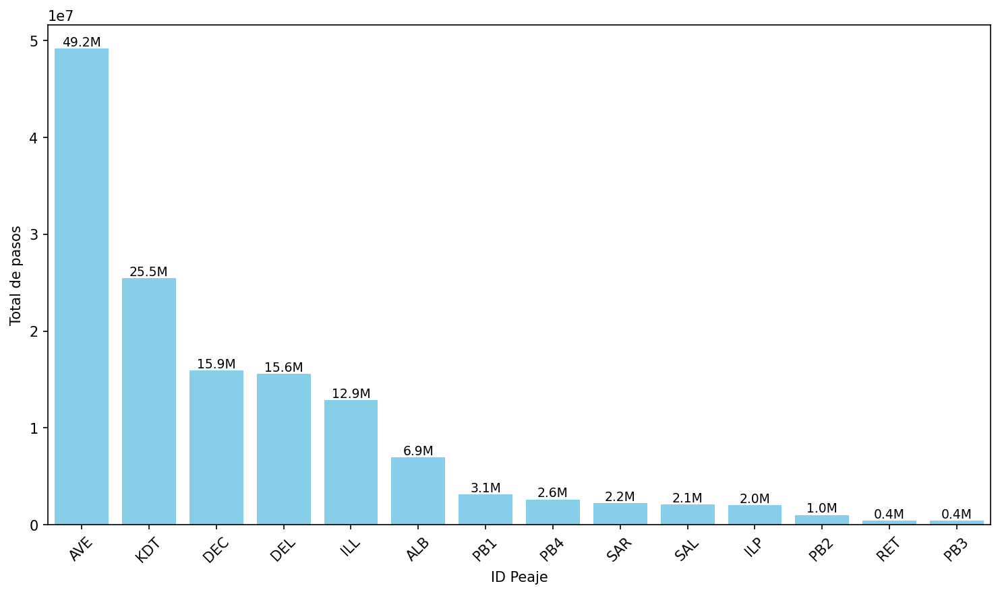
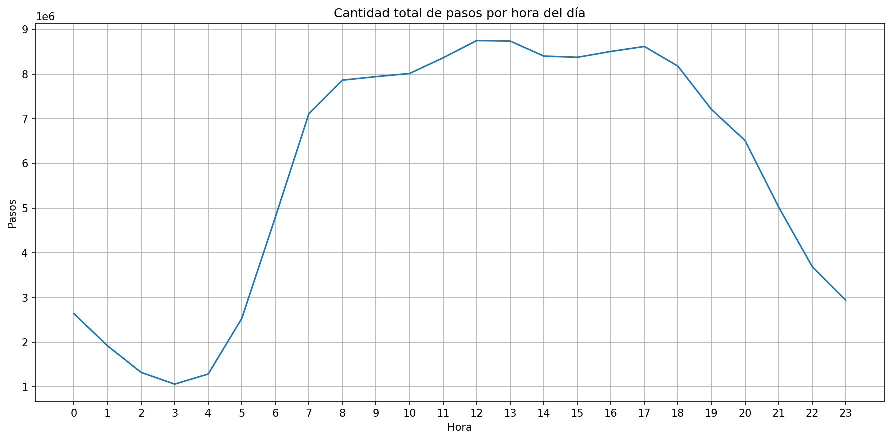
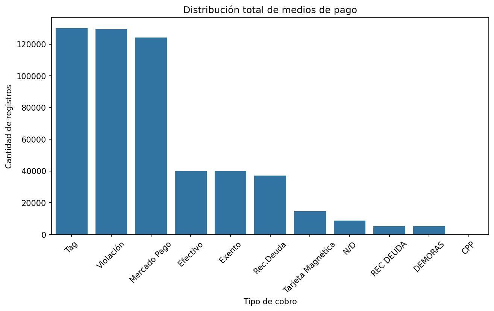

# 🚗 Análisis de tránsito vehicular en peajes de Buenos Aires

**Proyecto de análisis exploratorio de datos** con visualización interactiva, aplicado a un dataset público de tránsito en peajes de la Ciudad de Buenos Aires durante el año 2023.

---

## 📌 Objetivo

Analizar un conjunto de datos públicos sobre el tránsito vehicular en peajes de la Ciudad de Buenos Aires, con el fin de extraer patrones temporales (por hora y por mes), segmentaciones por peaje y comportamiento según tipo de cobro.

---

## 🔍 Dataset original

- Fuente: [Vehicular Traffic in Buenos Aires 2023 — Kaggle](https://www.kaggle.com/datasets/gasparpm/vehicular-traffic-in-buenos-aires-2023)

---

## 🧪 Proceso realizado

### 1. Carga y limpieza de datos (Google Sheets + Google Colab)

- Carga en Google Colab con entorno colaborativo.
- Exploración visual inicial del archivo `.csv` en Google Sheets.
- Conversión a DataFrame con Pandas.
- Revisión de tipos de datos.
- Detección y eliminación de duplicados.
- Limpieza de valores nulos y corrección de inconsistencias en campos categóricos.

### 2. Visualización exploratoria en Python
Se utilizaron las bibliotecas matplotlib y seaborn para obtener las primeras visualizaciones:
- Gráficos de líneas por hora del día, segmentados por ID de peaje.
- Distribución horaria total de pasos.
- Recuento general de medios de pago.

A partir de estas visualizaciones, se interpretaron comportamientos horarios diferenciados entre peajes y la relación general del volumen de tránsito con ciertas franjas horarias.

### 3. Visualización interactiva con Looker Studio

- Gráfico de líneas: pasos por hora y peaje.
- Gráfico de barras: pasos por ID de peaje.
- Gráfico circular: medios de pago.
- Gráfico de barras: registros por mes del año.

Todos estos elementos están vinculados mediante filtros cruzados, permitiendo explorar los pasos por peaje y medio de pago en una franja horaria especifica o mes de año, o viceversa.

### 4. Gráficos

#### Patrones Horarios

#### Pasos por hora según peaje

#### Cantidad total pasos por peaje

#### Cantidad total pasos por hora

#### Distribución medios de pago

---

## 📊 Hallazgos principales

- El tránsito aumenta significativamente entre las 7:00 y las 19:00 h, aplanando la curva en una 'franja de hora pico'. El peaje AVE duplica el volumen del segundo en importancia (KDT), que a su vez supera al tercero por medio millón de pasos.
- A partir de los peajes con menos de 300.000 pasos diarios, las curvas se aplanan y el tránsito es más constante a ki largo del día. Todos los peajes registran su hora baja a las 3:00 h, siendo una tendencia general..
- Se recomienda especial atención a los peajes de mayor tránsito segun las estrategias especificas de gestión de recursos, mantenimiento y recaudación.
- El análisis mes a mes expone un peaje que deja de operar en el mes 6 y otro que comienza a operar en el mes 5, indicando que podrían estar vinculados. Hay un tercer peaje que interrumpe sus registros entre los meses 8 y 10.  Requieren especial atención ya que podría presentar sesgos.
- El menor volumen del peaje líder (AVE) se registra en enero y febrero, que, junto a su enorme amplitud entre mínimos y máximos en horas picos, refuerza la hipótesis de su cercanía a zonas laborales.
- En todos los casos, la **tarjeta de telepeaje** es el método de cobro más utilizado, lo que puede orientar campañas de marketing o decisiones operativas.

---

## 🛠️ Tecnologías utilizadas

- Python (Pandas, Seaborn, Matplotlib) en Google Colab
- Google Looker Studio
- Google Sheets
- Google Drive

---

## 📂 Archivos del proyecto

- `colab/peajesBSAS_Colab.ipynb`: notebook de análisis exploratorio en Google Colab.
- `dashboard/LookerStudio_informe`: informe en PDF con visualizaciones interactivas exportadas.
- `dashboard/LookerStudio Dashboardlink`: acceso al dashboard en línea.

---

## 🔗 Acceso al dashboard (solo lectura)

[🔗 Ver en Looker Studio](https://lookerstudio.google.com/reporting/00ffa403-3a5b-4150-b36f-29e574a19354)

---

## ✍️ Autor

Juan Vaccari 

vaccari.juan.pablo@gmail.com
